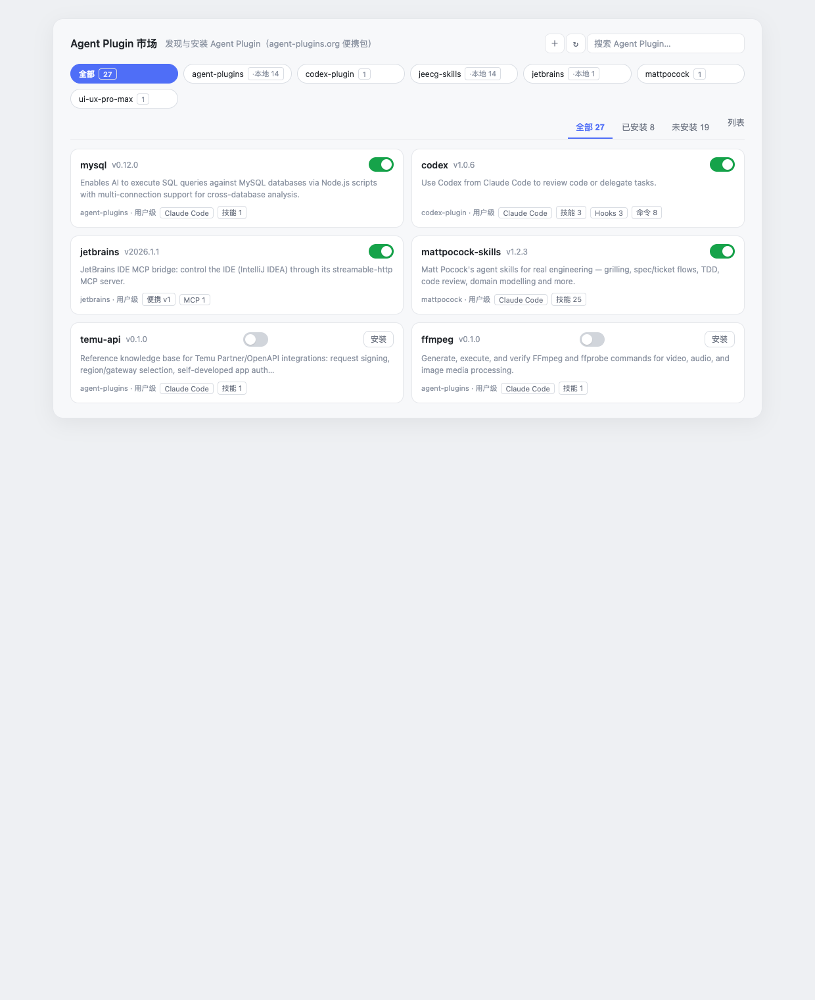

# Agent Plugin 市场（dsh-agent-plugin-market）

[English](README.en.md) | 简体中文

**DeepSeek Harness 的 Agent Plugin 管理器与市场**：从 git 仓库源安装、浏览、注入 Agent Plugin（套件）——技能（skills）、MCP 服务器、hooks、命令、子代理——兼容 agent-plugins.org v1.0.0 便携包与 Claude Code / Codex / Cursor / Kimi 生态。



## 它能做什么

- **套件管理**：配置 git 仓库源（市场），浏览每个源的套件，支持安装、卸载、启用、禁用、刷新；源 ID 自动从仓库清单 JSON 解析，无需手填。
- **运行时发现**：已安装套件从 `~/.dsh/agent-plugins/.sources/<源id>/`（用户维度）与 `<项目>/.dsh/agent-plugins/.sources/<源id>/`（项目维度）发现；本地源直接读取工作树（含未提交改动）。
- **运行时注入**：
  - **技能**：注册 `ctx.skills` SkillProvider（项目 rank 250 / 用户 rank 450），`${CLAUDE_PLUGIN_ROOT}` 自动替换，Claude Code 生态技能原样可用；
  - **MCP**：启用套件的 `mcp.json` 每个合法 server 动态挂载 `dsh-mcp-client` 子插件，工具名 `mcp__<套件>__<server>__<工具>`；
  - **Hooks**：套件 `hooks/hooks.json` 挂载 `dsh-hooks-claude-code` 桥，映射到宿主拦截点；
  - **命令 / 子代理**：`commands/*.md` 注册为 dsh 斜杠命令；`agents/*.md` 注册为 `agent-<name>` 技能；
  - **上下文**：会话启动注入启用套件清单（用户级 + 项目级），`agent_plugins` 工具可查询。
- **Web 市场页**：设置面板内的市场页——顶部源胶囊 + 搜索/操作、状态标签、两列卡片网格、套件详情弹窗（技能/MCP/hooks/命令/LSP 全部可预览）。

## 兼容的套件布局

| 布局 | 清单文件 | 说明 |
| --- | --- | --- |
| agent-plugins.org v1 | `plugin.json` | 内置 1.0.0 JSON Schema 校验 + 规范 §4 路径约束 |
| Claude Code 市场 | `.claude-plugin/marketplace.json` + 套件 `.claude-plugin/plugin.json` | marketplace `plugins[].source` 相对路径 |
| 通用（universal） | `.plugin/plugin.json` | 多客户端共存仓库（如 vercel-plugin） |
| Cursor | `.cursor-plugin/plugin.json` | 声明式 skills 路径 |
| Kimi | `.kimi-plugin/plugin.json` | 内联 mcpServers |
| Codex | `.codex-plugin/plugin.json` | — |
| 技能集合（无清单） | 无（合成） | 扁平 `SKILL.md` 目录集合 |

一个仓库可同时携带多种清单（如 vercel/vercel-plugin 全部都有）；套件身份取优先级最高的清单，内容面（skills/commands/agents/hooks/mcp）按目录扫描。`mcp.json` 与 `.mcp.json`、未知 transport 逐 server 容错。

## 安装

```sh
pnpm add dsh-agent-plugin-market   # 在某个 dsh profile 中
```

把本包加入 profile 的 `dsh.profile.bundles`（包内 `cordis.patch.yml` 自动插入插件行）：

```jsonc
// ~/.dsh/profiles/<profile>/package.json
{
  "dependencies": { "dsh-agent-plugin-market": "^0.4.0" },
  "dsh": { "profile": { "bundles": ["@deepseek-ai/dsh-base", "@deepseek-ai/dsh-web-app", "dsh-agent-plugin-market"] } }
}
```

重启 dsh，在 设置 → Agent Plugin 市场 中管理。

## 配置仓库源

源持久化在 `~/.dsh/agent-plugins/state.json`，也可用 cordis 配置预置（也是"持久种子"，启动时自动补齐缺失源）：

```yaml
- id: dsh-agent-plugin-market
  config:
    sources:
      - { id: agent-plugins, url: 'https://github.com/Sivan757/agent-plugins.git' }
      - { id: jeecg-skills, url: '/Users/me/work/jeecg-plugin', local: true }
      - { id: ui-ux-pro-max, url: 'https://github.com/nextlevelbuilder/ui-ux-pro-max-skill.git' }
```

`local: true` 的源直接读取本地目录（实时反映工作树，移除源时不会删除目录）。

## 环境要求

- 必需 `ctx.skills`（dsh-skill）。
- 可选 peer：`@deepseek-ai/dsh-mcp-client`（MCP 注入）、`@deepseek-ai/dsh-hooks-claude-code`（hooks 桥），缺失时对应能力受控降级。
- Web GUI ≥ 0.1.0-rc.6。

## 安全模型

- git 源经 `execFile` 克隆（无 shell），`--depth 1`，`--ff-only`，120s 超时；本地源原地读取、移除不删除。
- 变更类 HTTP 路由仅接受同源 POST，请求体上限 64 KiB。
- 便携包路径必须 `./` 开头且解析后留在套件根内（拒绝 symlink 逃逸）；`${PLUGIN_ROOT}`/`${PLUGIN_DATA}` 展开。
- 第三方套件故障永远受控：坏清单、非法技能、逃逸路径、未知 MCP transport、挂载失败均为逐套件诊断。
- 错误边界包裹整个市场区与详情弹窗：任何预览渲染异常降级为提示，不会崩掉界面。

## 开发

```sh
pnpm install
pnpm run test        # vitest（fixture 套件 + 多范式解析）
pnpm run typecheck
pnpm run build       # tsc 宿主 + tsdown 客户端 + 模块加载器包装
pnpm pack            # 构建并打 tgz
```

## 已知限制

- 项目维度 MCP server 不挂载（dsh 无按会话的 tool scope）；项目维度覆盖技能 + 上下文。
- 技能发现无文件监听：目录变化在管理动作或重启后生效。
- Claude Code hooks 仅支持 bridge 映射的子集；LSP 只计数与预览，不执行。

## Vendored 资产

`schemas/1.0.0/` 下的 JSON Schema vendored 自 [agentplugins/agent-plugins-spec](https://github.com/agentplugins/agent-plugins-spec)（spec 1.0.0 working draft）；规范要求加载时不得联网取 schema。
